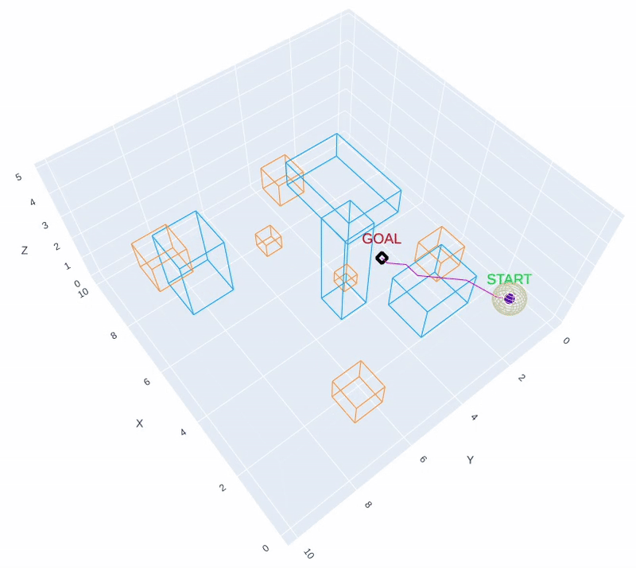

# 3D Path Planning in Dynamic Environment


## Project Overview

This project implements **3D path planning in dynamic environments** using a voxelized 3D grid representation and interactive visualization:
- Static obstacles are known a priori
- Dynamic obstacles are unknown and only detected via local sensing
- The planner must replan online as new obstacles are discovered

Three planning paradigms are implemented:

1. **Offline 3D A\*** (baseline): full knowledge of static + dynamic obstacles, single-shot planning
2. **Online A\*** : static obstacles known, dynamic obstacles discovered via local sensing and replanning
3. **Online D\* Lite** (in progress): incremental replanning that reuses prior search results

The system produces interactive 3D visualizations and quantitative metrics for each run.


## Planner Modes

**All planners operate on a voxelized 3D grid with known static obstacles.**

### 1. Offline A* (baseline)
- Dynamic obstacles are conservatively treated as inflated static volumes
- Path is computed once at the beginning
- Supports 6- or 26-connected neighborhoods

### 2. Online A* (replanning with local sensing)
- Dynamic obstacles are **unknown** and only sensed within a local radius
- The probe replans whenever new obstacles enter its sensing region
- Planning time is accumulated across all replanning steps

### 3. Online D* Lite (in progess)
- Uses incremental replanning instead of restarting A* from scratch
- Designed to reduce total planning time in highly dynamic environments
- Included in the codebase but not fully functioning


## Project Structure

```
3D-Path-Planning-in-Dynamic-Environment/
|
├── environments/
|   ├── *.json                   # saved environments (static + dynamic obstacles)
│
├── examples/                    # core modules
│   ├── generate_env.py          # create environment + save + preview visualization
|   ├── generate_env_complex.py  # same as generate_env.py but creates more complex environment
│   ├── plan_and_visualize.py    # main entry point: load an environment + run planner + animate visualization
|
├── planners/
│   ├── astar3d.py               # Offline 3D A* with 6/26 neighbors
│   ├── online_astar.py          # Online A* with local sensing and replanning
│   ├── dstar_lite.py            # Online D* lite (incremental replanning)
│
├── world/
│   ├── schema.py                # obstacle, Frame, Scenario dataclasses
│   ├── env_config.py            # EnvironmentConfig dataclass
│   ├── env_io.py                # json save/load utilities
│   ├── grid_world.py            # 3D occupancy grid
│   ├── geometry_utils.py        
│
├── viz/
│   ├── plotly_viz.py            # plotly rendering of 3D Scenario
│
├── results/                     
│   ├── visualizations           # generated visualizations (HTMLs)
│   ├── metric_scores            # planner performance metrics
|
├── docs/                        # project related documents (report, papers., etc.)   
├── requirements.txt
└── README.md
```


## Instructions on how to run the code

### Step 1: Clone the repository
```
git clone https://github.com/srijanpal07/3D-Path-Planning-in-Dynamic-Environment.git
```

### Step 2: Set up
You can use either Python venv or Conda to create a virtual environment and install dependencies.

```
cd 3D-Path-Planning-in-Dynamic-Environment/
python3 -m venv .venv
source .venv/bin/activate
pip install -r requirements.txt
```

### Step 3: Running the code
Run the main script that loads an environment, runs a planner from start to goal, and outputs a full animation showing obstacles + trajectory + probe motion.
```
python -m examples.plan_and_visualize --planner online_astar --env environments/env3.json --sensor-radius 0.5
```
Supported command-line arguments:
```
"--env": Path to environment JSON file.
"--outfile": Output HTML file name.
"--planner": Planner type (offline A* or online A*).
"--neighbors": Number of neighbors for A* (26 or 6) used by offline A*.
"--sensor-radius": Sensor radius (m) for detecting obstacles used by online A*.
```
**Current outputs should be saved in the root directory.**
```
viz_{planner}_{environment}.html       # visualization
metrics_{planner}_{environment}.json   # metric scores
```
Open the .html file in any browser to view the scene and .json file to get the score metrics.

### Step 4 (Optional): Generate an environment
Generate a new 3D environment with static and dynamic obstacles and save it as a JSON file:
```
python -m examples.generate_env
```
The generated environment is saved to the environments/ directory and can be reused for offline or online planning experiments.


## Results
The results generated by all planners across all the environments are stored in the directory (results/), with visualizations in (results/visualizations), and the corresponding metric scores in (results/metric_scores).

**Visualization:** The interactive Plotly visualization shows:
- **Purple sphere**: the probe (agent)
- **Magenta path**: current planned trajectory
- **Blue path**: executed (traversed) trajectory
- **Blue boxes**: static obstacles
- **Orange boxes**: dynamic obstacles
- **Transparent wireframe sphere**: sensor radius (online planners only)
- The visualization updates over time to reflect obstacle motion, replanning events,
and probe movement.

**Evaluation Metrics:** For each planner–environment pair, the following metrics are recorded:
- **Success / Failure**: Whether the probe reaches the goal with failure reasons (e.g., no path found during replanning) are logged
- **Planning Time (seconds)**: Offline A*: single-shot planning time; Online planners: total time accumulated across all replanning steps
- **Path Length (meters)**: Total distance traveled by the probe
- **Number of Replans** (online planners only): Counts how many times replanning was triggered due to sensing


### Example Visualizations

<div align="center">
  <table>
    <tr>
      <td align="center">
        <br>
        <b>Offline A* (Environment 2)</b>
      </td>
      <td align="center">
        <br>
        <b>Online A* (Environment 1)</b>
      </td>
      <td align="center">
        <br>
        <b>Online A* (Complex Environment)</b>
      </td>
    </tr>
  </table>
</div>


## Requirements
```
Python 3.10
numpy==2.2.6
plotly==6.3.1
```